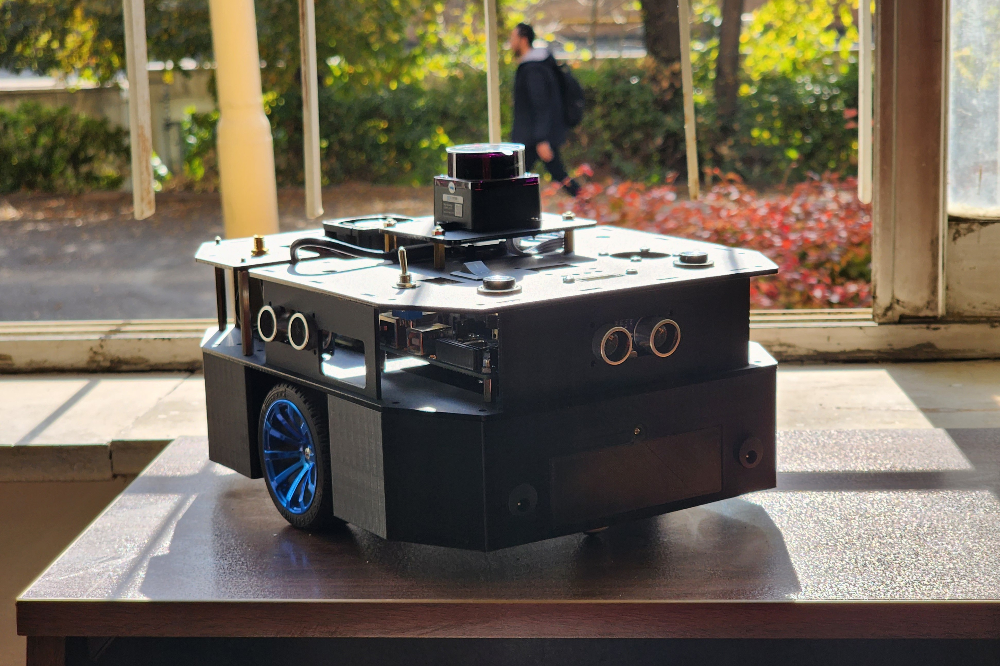
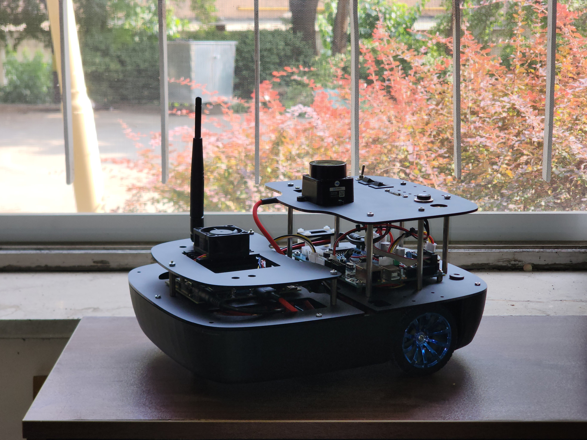
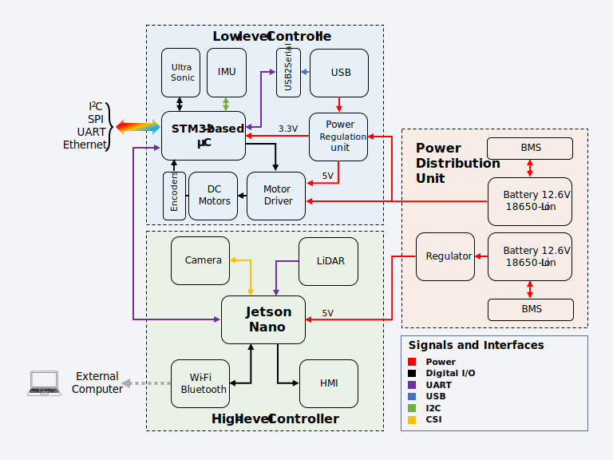
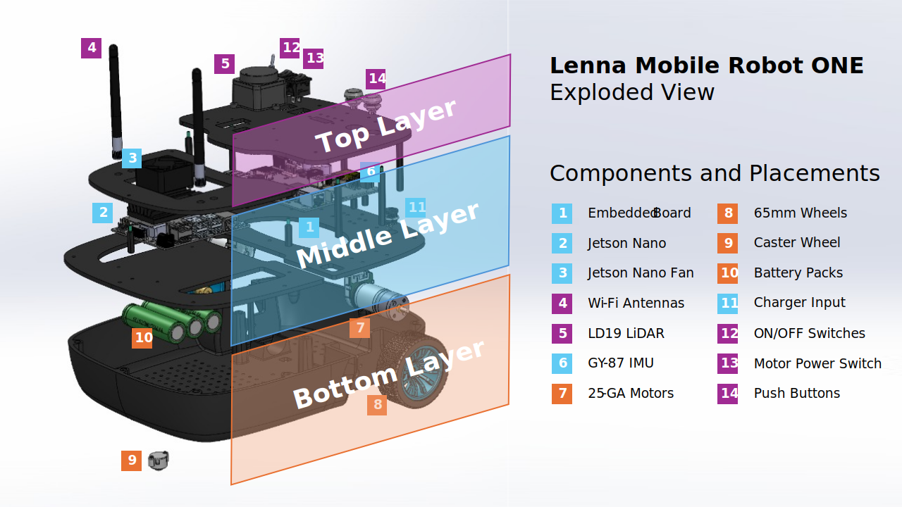
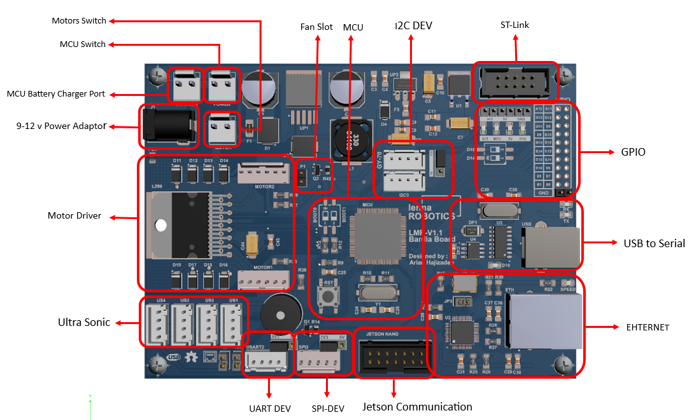
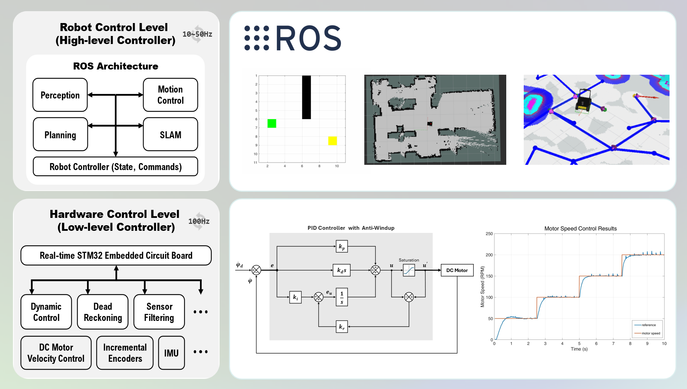

<div align="justify">

# Lenna Mobile Robot ONE
Lenna Autonomous Mobile Robot is designed for educational and research purposes. It is built upon a robust hardware architecture that combines an ARM-based embedded microcontroller and a Jetson Nano single-board computer (SBC) to provide both low-level and high-level control capabilities.

<div align="center">

|  |  |
|:--:|:--:| 
| Lenna Mobile Robot ONE | LMRO Revised Model |

</div>


## Repository Structure

    .
    ├── hardware/                # Design & implementation
    │   ├── mechanics/           # CAD, 3D models, assembly instructions
    │   └── electronics/         # Schematics, PCB layouts, wiring
    │
    ├── software/
    │   ├── embedded/            # Microcontroller code (C/C++)
    │   ├── ros/                 # ROS packages, launch files, nodes
    │
    ├── docs/
    │   ├── user_manual/         # Setup, architecture, coding style
    │   └── figures/             # Images, diagrams, plots
    │
    └── README.md                # Entry point, quick start

## List of Contents
- [System Overview](#system-overview)
- [Mechanical Design](#mechanical-design)
- [Electronics Design](#electronics-design)
- [Control Architecture](#control-architecture)
- [Plug and Play](#plug-and-play)

## System Overview
The current design is a differential-drive Wheeled Mobile Robot (WMR) that employs a two-layer hierarchical
architecture consisting of a High-level Controller Board (HCB) and a Low-level Controller Board (LCB). The
HCB, which is either an Nvidia Jetson Nano B01 or an Nvidia Jetson Orin Nano depending on the target
ROS version, handles high-level processing, runs ROS, and interfaces with the Light Detection and Ranging
(LiDAR) sensor. The LCB is a custom-designed microcontroller-based embedded board built, responsible for
sensor interfacing and motor control. Communication between the two boards is established via Universal
Asynchronous Receiver/Transmitter (UART) serial communication and a custom protocol.

<div align="center">

|  |
|:--:| 
| LMRO Physical Architecture |
</div>

### Mechanical Design
In
this work, a differential drive mobile robot was developed following the unicycle kinematic model, which is
one of the most widely adopted models for wheeled robotic systems. The design process was carried out in
SolidWorks, with an emphasis on modularity, simplicity, and ease of future expansion. The proposed robot architecture follows a three-level stacked structure, where each layer hosts a distinct set of
components. This modular design allows rapid prototyping and straightforward replacement or modification
of subsystems without interfering with the core mechanical or electrical functionalities.


|  |
|:--:| 
| LMRO Revised Model Exploded View and Components |

### Electronics Design
As mentioned earlier, the Lenna Robotics team has designed a custom PCB for the LCB, referred to as the
Bardia Board. The complete design is available on the Lenna Robotics GitHub page, and the following sections
provide details on the design choices, the considerations that shaped them, and the resulting component
selection.

<div align="center">

|  |
|:--:| 
| LMRO Low-level Controller Board |

</div>

### Control Architecture
As previously mentioned, this robot employs a distributed architecture. In this architecture, robot control is
divided into two layers: the hardware control layer (LCB) and the robot control layer (HCB). The hardware
control layer is responsible for reading and filtering sensor data as well as controlling the motor dynamics. In contrast, the robot control layer handles more complex computations and high-level
decision-making. This hierarchical structure decouples the robot control from its governing dynamic equations and allows motion control to focus on kinematics at the velocity layer.
<div align="center">

|  |
|:--:| 
| LMRO Hierarchical Control Architecture |

</div>

## Plug and Play
This section provides step-by-step procedures to create your own ROS workspace and run the nodes required to work with the **Lenna Mobile Robot (LMRO)**.

Always source your ROS distribution:

```bash
source /opt/ros/<distro>/setup.bash
```

Create your ROS workspace and add the mentioned lenna packages to the `/src` directory:

```bash
mkdir -p ~/lenna_ws/src
cd ~/lenna_ws
catkin build
```

Source the compiled workspace:

```bash
source ~/lenna_ws/devel/setup.bash
```

### Teleoperation
You can use the ROS package `teleop_twist_keyboard` to control LMRO using the `lenna_teleop_keyboard` launch file inside the `lenna_bringup` package:

```bash
roslaunch lenna_bringup lenna_teleop_keyboard.launch
```

### SLAM
Both `slam_toolbox` and `hector_slam` can be used for LMRO:

```bash
roslaunch lenna_bringup lenna_slam_toolbox.launch
```

or

```bash
roslaunch lenna_bringup lenna_slam_hector.launch
```


### Navigation
Using the `lenna_navigation_stack` launch file, you can use the ROS NavStack (`move_base` and `amcl` packages) to implement autonomous navigation:

```bash
roslaunch lenna_bringup lenna_navigation_stack.launch
```

</div>
