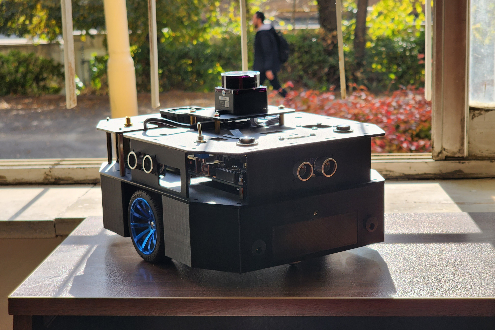

# Lenna Autonomous Mobile Robot

  

## Introduction
LENNA Autonomous Mobile Robot is designed for educational and research purposes. It is built upon a robust hardware architecture that combines an ARM-based embedded microcontroller and a Jetson Nano single-board computer (SBC) to provide both low-level and high-level control capabilities.

At the core of the robot is the ARM-based embedded microcontroller, which is responsible for the real-time control of the motors and the reading of various sensors. This includes implementing motor control using PID (Proportional-Integral-Derivative) algorithms and efficiently handling sensor data, such as from inertial measurement units and wheel encoders. The embedded microcontroller enables the robot to perform precise dead-reckoning navigation by fusing odometry information from the encoders.

The Jetson Nano SBC, on the other hand, is dedicated to executing higher-level tasks. It is responsible for processing data from sensors like cameras and LiDAR units, enabling the robot to perceive its environment. This allows the implementation of advanced navigation algorithms, such as Simultaneous Localization and Mapping (SLAM), which combine odometry and laser scan data to build a map of the surroundings and localize the robot within it.

## Folder Structure
    .  
    ├── Resources  
    │   ├── Datasheets  
    │   ├── Reading Materials  
    │   └── Comparable Products  
    ├── Design  
    │   ├── Conceptual Design  
    │   ├── Simulation 
    │   ├── Detailed Design  
    │   │   ├── Mechanics  
    │   │   ├── Electronics  
    │   │   └── Source Code  
    │   └── Unit Tests 
    ├── Documentaion  
    │   ├── User Manuals  
    │   ├── Technical Notes      
    │   └── Figures  
    └── ...  
    
## Mechanics

## Electronics

## Software

